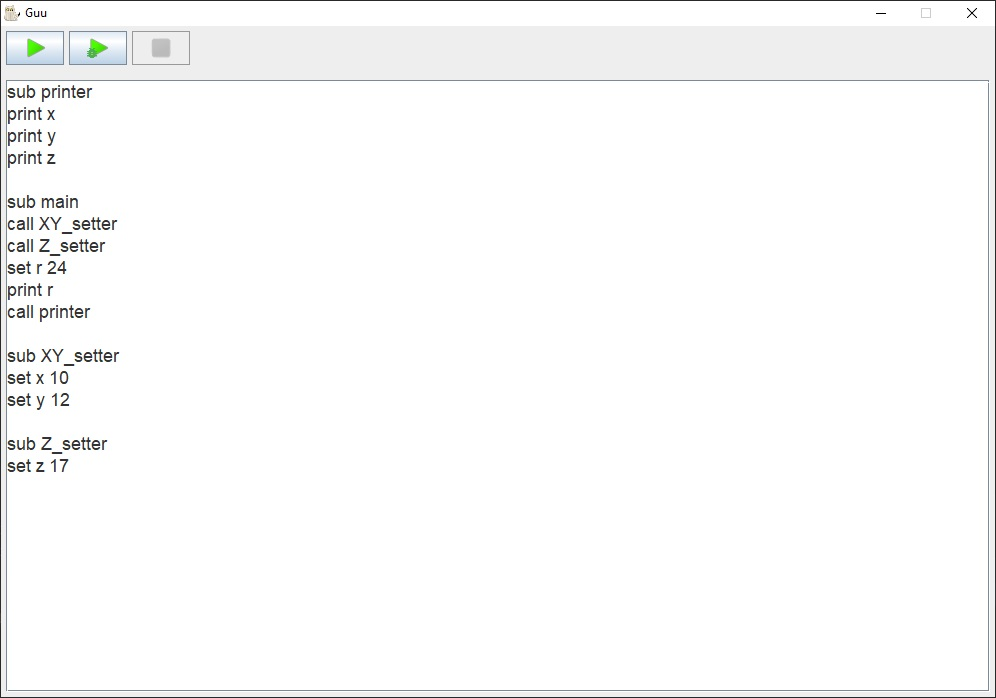
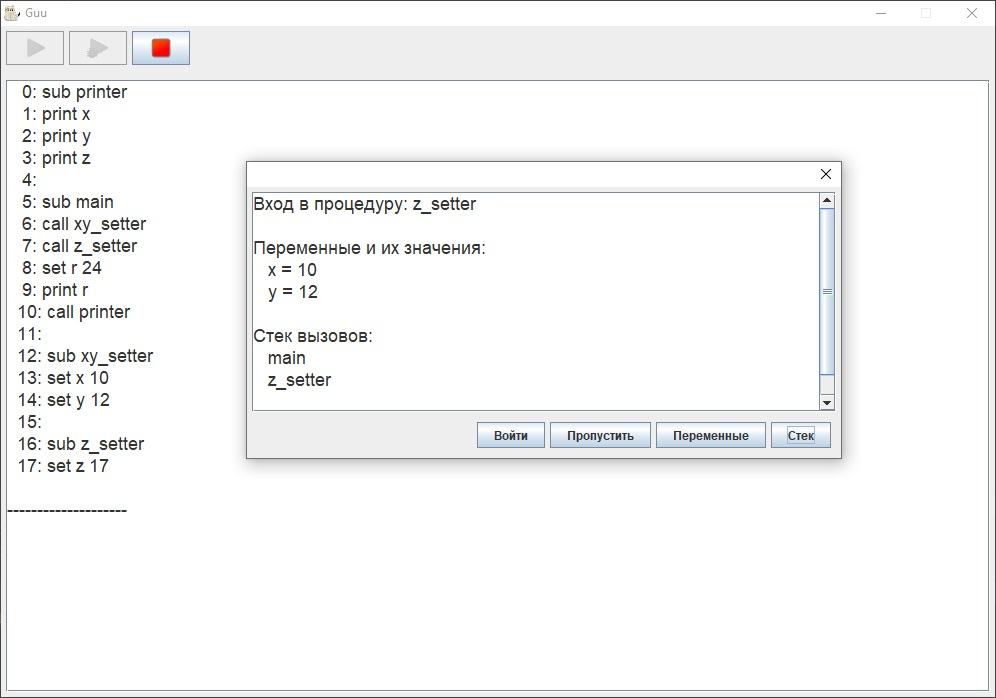
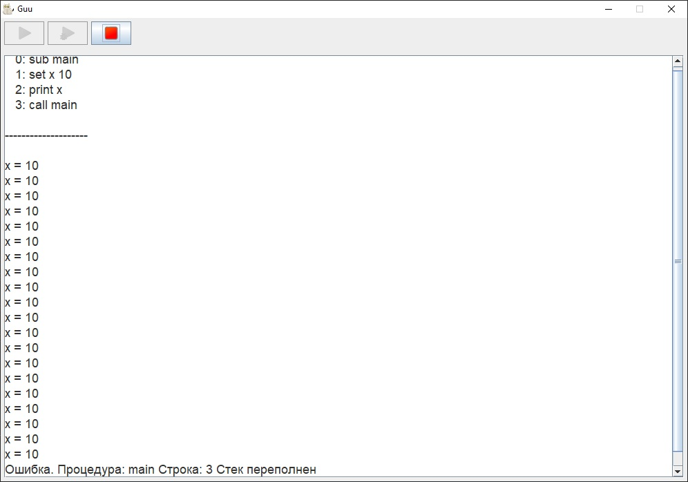

# Guu

На создание данного прокета меня вдохновил [вот этот пост на Хабре](https://habr.com/ru/post/454354/)
Автор поста рассказывает о своем опыте решения тестового задания от компании JetBrains. Текст задания я привожу ниже:

---

Задача: реализовать пошаговое исполнение кода для тривиального языка программирования Guu. 

Внимание: в описании ниже заведомо опущены некоторые существенные моменты. Как правило, они остаются на ваше усмотрение. 

Программа на Guu состоит из набора процедур. Каждая процедура начинается со строки sub (subname) и завершается объявлением другой процедуры (или концом файла, если процедура в файле последняя). Исполнение начинается с sub main. 

Тело процедуры – набор инструкций, каждая из которых находится на отдельной строке. В начале строки могут встречаться незначимые символы табуляции или пробелы. Пустые строки игнорируются. Комментариев в Guu нет. 

В Guu есть лишь три оператора: 
   — set (varname) (new value) – задание нового целочисленного значения переменной. 
   — call (subname) – вызов процедуры. Вызовы могут быть рекурсивными. 
   — print (varname) – печать значения переменной на экран. 

Переменные в Guu имеют глобальную область видимости. Программа ниже выведет на экран строку a = 2. 

sub main 
set a 1 
call foo 
print a 

sub foo 
set a 2 

А вот простейшая программа с бесконечной рекурсией: 

sub main 
call main 

Необходимо написать пошаговый интерпретатор для Guu. При его запуске отладчик должен останавливаться на строчке с первой инструкцией в sub main и ждать команд от пользователя. Минимально необходимый набор команд отладчика: 

i – step into, отладчик заходит внутрь call (subname). 
o – step over, отладчик не заходит внутрь call. 
trace – печать stack trace исполнения с номерами строк, начиная с main… 
var – печать значений всех объявлённых переменных. 

Формат общения пользователя с отладчиком остаётся на выше усмотрение. Вы можете выбрать как минималистичный GDB-like интерфейс, так и консольный или графический UI. Названия команд отладчика можно при желании изменить. 

Для решения этой задачи вы можете использовать любой язык программирования из TIOBE TOP 50 и open-source компилятором/интерпретатором. 

При оценке работы будет оцениваться: 

Общая работоспособность программы; 
Качество исходного кода и наличие тестов; 
Простота расширения функциональности (например, поддержка новых операторов языка или инструкций отладчика).

---

Итак, я решал задачу используя Java. Сразу оговорюсь, что в решение автора поста на хабре я не заглядывал. Для своего приложения я создал простой графический интерфейс.
Окно состоит из двух частей: часть с текстовым полем для ввода кода и часть с текстовым полем для вывода данных программой.
Есть три кнопки: первая запускает код на выполнение, вторая - запускает отладчик, третья - возвращает пользователя обратно к вводу исходного кода на Guu.

Под капотом приложения следующие классы:
- MainClass. С него начинается выполнение программы. Он создает объекты остальных основных классов программы.
- GUI. Создает графический интерфейс.
- Resources. Необходим для загрузки графических ресурсов программы.
- Executor. Класс, ответственный за разбор и исполнение кода на Guu.
- Context. Текущий контекст исполнения. Этот класс инкапсулирует в себе все параметры текущей сессии исполнения кода: строки программы,   значения переменных, адреса процедур, стек вызовов, указатель на текущую строку кода и т.д.
- Utils. Данный класс содержит набор методов, необходимых для предварительного анализа кода (разбиение исходного кода на отдельные         строки, посик процедур и их адресов, проверка корректности имен процедур и переменных)
- ReservedWords. Данное перечисление очень важно для работы всей программы. В нем содержатся все ключевые слова языка Guu и связанные с   их выполнением процедуры.
- DebugDialog. Класс необходим для вывода информации в режиме отладки.
- Классы пакета Command. Каждый класс данного пакета ответственнен за исполнение отдельной команды на Guu. Все классы должны               удовлетворять интерфейсу Command.
 
Выполнение кода Guu организовано таким образом. Объект executor через метод start получает строку с исходным кодом и флаг режима работы (обычный режим или режим отладки). первым делом executor начинает подготовку текущего контекста выполнения: код разбивается на отдельные строки, ищутся имена и адреса всех процедур. Затем вызывается процедура main.

Каждый вызов процедуры сопровождается внесением данных о ней в стек: это имя самой процедуры и указатель на текущую команду внутри процедуры. Также, если включен режим отладки, при каждом вызове процедуры выводится диалог с запросом действий пользователя: можно выбрать вход в процедуру, пропуск процедуры, просмотр стека вызовов и просмотр значений переменных.

После вызова main эстафета передается методу executeCode. Он запрашивает стек вызовов процедур и если он пуст, то это является признаком окончания работы. Если он не пуст, то из него извлекается текущая строка кода и запускается ее анализ (пустые строки пропускаются, конец файла интерпретируется как конец текущей выполняемой процедуры и удаление ее данных из стека).

Текущая строка кода анализируется в методе executeLine. Из строки кода извлекается ее оператор и происходит поиск такого же оператора в перечислении ReservedWords. С каждым элементом данного перечисления связан экземпляр класса, реализующего интерфейс Command и выполняющего соответствующую команду (SubCommand, CallCommand, SetCommand, PrintCommand). При этом в метод выполнения команды передается текущий контекст (для доступа к стеку, полю вывода и значениям переменных) и строка кода, из которой метод извлекает (парсит) нужные только ему данные.

Таким образом, если необходимо расширить язык Guu новыми командами, то достаточно только реализовать интерфейс Command для соотвествующего добавляемого оператора и включить его в перечисление ReservedWords.

Если парсинг параметров команды не успешен, либо саму команду не удается распознать (например, пользователь ввел seet x 10 вместо set x 10), то возбуждается исключение, пользователю выводится информация о причине и месте возникновения ошибки и работа интерпретатора прекращается.

Также еще раз замечу, что вызовы call в режиме отладки перехватываются и у пользователя запрашиваются дальнейшие действия. Список действий отладчика легко расширить, так как перехват любых других команд также прост как перехват call и вся информация о текущей сессии исполнения достпна в текущем комнтексте (экземпляре context).

Кроме того, вызовы процедур могут быть рекурсивными. Для того, чтобы рекурсия не стала бесконечной (так как в Guu нет условных операторов, способных ее прервать), я добавил ограничение размера стека вызовов в 20 процедур (хотя ничто не мешает сделать его и больше)

Также данный проект - это первый проект, в котором я написал тесты JUnit/ Пусть они и не покрывают абсолютно весь код приложения, но основные функции разбора и выполнения кода Guu, тем не менее, покрыты тестами.

Скриншоты приложения ниже:

